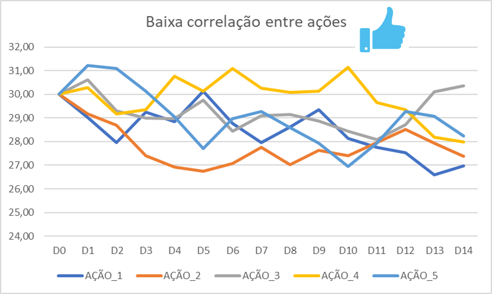

# acoes_ag
Otimização de carteira de investimento com algoritmos genéticos

# **Objetivo**

## Identificar uma carteira de ações que otimize o resultado de três objetivos  conjuntos:
- Minimizar a correlação total da carteira (média entre a correlação dos pares de ações).
- Maximizar o retorno total da carteira (diferença percentual entre o primeiro e o último dia do período avaliado).
- Maximizar a quantidade de dias que a carteira possui variação diária positiva dentro do período avaliado.

Os dados processados fazem referência às cotações das ações na Bolsa de Valores Brasileira (B3) no período entre 2018 e 2020.

Os dados foram coletados pelo notebook `ag_acoes_coleta_dados.ipynb` e consolidados num dataframe Excel que é importado no notebook `ag_acoes_4.ipynb`.

O processamento da otimização é feito através de algoritmos genéticos usando a biblioteca `deap`.

---

# **Detalhamento dos objetivos**

## Minimizar a correlação total da carteira

É desejável que as ações escolhidas tenham baixa correlação entre si, aumentando assim a diversificação da carteira.

## Maximizar o retorno total da carteira

Esta é a função que mede o retorno efetivo da carteira. Diferença entre o valor total investido e o valor ao fim do período.

Diferença percentual entre o primeiro e o último dia do período avaliado.

## Maximizar a quantidade de dias que a carteira possui variação diária positiva

É desejável que a variação diária dentro do período tenha a maior quantidade de dias com sinal positivo, independente do tamanho da variação.

## Função objetivo final

A função objetivo final se dá pela junção dos resultados dos três objetivos. 

Todos os objetivos possuem o mesmo peso, sendo que o objetivo de correlação possui sinal negativo.

FO = - fo\_correlacao + fo\_retorno\_medio + fo\_dias\_variacao\_positiva

---

# **Cenários de otimização** (estrutura do notebook)

O desenvolvimento do notebook é guiado pelas seguintes definições e cenários para contextualização da problemática.

## Definições gerais

Os dados contém as cotações diárias de 196 ações distintas entre 2018 e 2020.

Dado um período de análise (ex.: mês de dezembro de 2020), o algoritmo deve identificar uma carteira de ações que atenda conjuntamente aos objetivos definidos.

Restrições da carteira:

- Ser composta por  pelo menos 7 ações e no máximo 10 ações.
- Dentre os pares de combinação de ações escolhidas, não deve ter par de ação com correlação maior que 0.8.

## Avaliação das métricas do processamento do AG

Nesta parte é feita a otimização da carteira para um mês específico e analisadas as métricas resultantes do AG.

## Simulação de carteira otimizada

Nesta parte é feita a seguinte simulação para cada mês entre 2018 e 2020:
- Otimizar uma carteira considerando o mês i.
- Usar a carteira otimizada para investir no mês i+1.
- Comparar o retorno com a variação do índice BOVESPA no período.
